# Starepo - GitHub Star 智能管理工具

> 仍在建设中……

一个基于 Electron 的本地桌面应用，帮助你智能管理和检索 GitHub Star 项目。通过 AI 向量化技术和自然语言对话，让你的 Star 项目不再石沉大海。

## 🌟 核心功能

- **GitHub 集成**: 自动同步你的 GitHub Star 项目信息
- **智能向量化**: 使用 Embedding 技术对项目进行语义理解
- **AI 对话检索**: 通过自然语言快速找到相关项目
- **本地存储**: 使用 ChromaDB 进行本地向量数据库存储
- **离线使用**: 数据完全本地化，保护隐私
- **实时同步**: 支持增量同步最新的 Star 项目

## 🛠️ 技术栈

### 核心框架 🏍️

- [Electron 37.2.5](https://www.electronjs.org) - 跨平台桌面应用框架
- [Vite 7.0.6](https://vitejs.dev) - 现代化构建工具
- [React 19.1.1](https://reactjs.org) - 用户界面库
- [TypeScript 5.8.3](https://www.typescriptlang.org) - 类型安全的 JavaScript

### AI & 数据处理 🤖

- [ChromaDB](https://www.trychroma.com/) - 本地向量数据库
- [AI SDK V5](https://ai-sdk.dev/) - 统一的 AI 接口，支持多种 AI 提供商
- [GitHub API](https://docs.github.com/en/rest) - GitHub 数据获取

### UI & 用户体验 🎨

- [Tailwind 4.1.11](https://tailwindcss.com) - 原子化 CSS 框架
- [Shadcn UI](https://ui.shadcn.com) - 现代化组件库
- [Geist](https://vercel.com/font) - 优雅字体
- [Lucide](https://lucide.dev) - 图标库
- [TanStack Router](https://tanstack.com/router) - 路由管理
- [i18next](https://www.i18next.com) - 国际化支持

### 开发工具 🛠️

- [Prettier 3.6.2](https://prettier.io) - 代码格式化
- [ESLint 9.32.0](https://eslint.org) - 代码检查
- [Zod 4.0.14](https://zod.dev) - 数据验证
- [React Query (TanStack)](https://react-query.tanstack.com) - 数据状态管理

### 测试框架 🧪

- [Vitest 3.2.4](https://vitest.dev) - 单元测试框架
- [Playwright 1.54.2](https://playwright.dev) - 端到端测试
- [React Testing Library 16.3.0](https://testing-library.com/docs/react-testing-library/intro) - React 组件测试

### 打包分发 📦

- [Electron Forge](https://www.electronforge.io) - 应用打包和分发

## 🏗️ 功能规划

### Phase 0: 架构重构 ✅ (已完成)
- [x] **Electron 进程分离架构**：主进程、渲染进程、预加载脚本分离
- [x] **类型安全的 IPC 通信**：统一 IPC 通道管理和类型定义
- [x] **现代化项目结构**：按功能和进程分层的目录结构
- [x] **安全的 API 桥接**：预加载脚本安全暴露主进程功能
- [x] **React Hooks 集成**：useTheme、useWindow 等自定义 Hooks
- [x] **开发工具链优化**：Vite、TypeScript、ESLint 配置更新

### Phase 1: 基础功能 (MVP)
- [ ] **GitHub 集成系统** (基于 [Octokit.js](https://github.com/octokit/octokit.js))
  - [ ] Personal Access Token 认证方式
  - [ ] 安全的 Token 存储和管理（使用 Electron safeStorage）
  - [ ] 完整的 GitHub API 集成（用户信息、仓库管理、Star 操作）
  - [ ] 速率限制监控和智能重试机制
  - [ ] 多层缓存策略（内存 + IndexedDB）
- [ ] **Star 项目数据管理**
  - [ ] 增量同步 Star 项目列表
  - [ ] 项目详细信息获取（语言统计、README、发布版本）
  - [ ] 实时 Star/Unstar 操作同步
- [ ] **基础搜索和筛选**
  - [ ] 按名称、描述、语言筛选
  - [ ] 按 Star 数、更新时间排序
  - [ ] 标签和主题过滤

### Phase 2: 智能化升级
- [ ] ChromaDB 本地向量数据库集成
- [ ] OpenAI Embedding API 集成
- [ ] 项目描述和 README 向量化
- [ ] 基础的语义搜索功能

### Phase 3: AI 对话系统
- [ ] 聊天界面设计和实现
- [ ] 自然语言查询处理
- [ ] 上下文感知的对话系统
- [ ] 搜索结果智能排序

### Phase 4: 高级功能
- [ ] 项目标签和分类管理
- [ ] 个人笔记和评价系统
- [ ] 数据导出和备份功能
- [ ] 多账户支持
- [ ] 离线模式优化

## 🏛️ 系统架构

### 整体架构

```mermaid
graph LR
    Frontend[前端界面<br/>• React UI<br/>• Chat 界面<br/>• 项目列表<br/>• 搜索功能]
    MainProcess[主进程<br/>• GitHub API<br/>• ChromaDB<br/>• 数据处理<br/>• IPC 通信]
    ExternalServices[外部服务<br/>• GitHub API<br/>• OpenAI API]
    
    Frontend <--> MainProcess
    MainProcess <--> ExternalServices
```


### 数据流程
1. **数据获取**: GitHub API → 项目基础信息
2. **数据处理**: README/描述 → AI SDK Embedding → 向量数据
3. **数据存储**: ChromaDB 本地向量数据库
4. **智能检索**: 用户查询 → 向量相似度搜索 → 结果排序
5. **对话交互**: 自然语言 → 意图识别 → 精准搜索

### 项目配置 🎯

- **安全隔离**: 启用 Context Isolation，主进程和渲染进程完全分离
- **编译优化**: React Compiler 默认启用
- **界面设计**: 隐藏标题栏，使用自定义标题栏
- **字体选择**: Geist 作为默认字体
- **开发工具**: React DevTools 预装
- **数据安全**: 所有数据本地存储，保护用户隐私
- **类型安全**: 完整的 TypeScript 支持，IPC 通信类型安全
- **模块化架构**: 按功能分离的服务层，易于维护和扩展

### 架构优势 🏆

1. **安全性**: 
   - Context Isolation 确保渲染进程无法直接访问 Node.js API
   - 预加载脚本提供受控的 API 暴露
   - 敏感操作只在主进程中执行

2. **可维护性**:
   - 清晰的进程分离，职责明确
   - 统一的 IPC 通道管理
   - 类型安全的接口定义

3. **可扩展性**:
   - 模块化的服务层设计
   - 易于添加新功能模块
   - 支持插件化架构

4. **开发体验**:
   - 完整的 TypeScript 支持
   - React Hooks 简化状态管理  
   - 热重载和开发工具集成

## 📁 项目结构

```plaintext
.
└── ./src/
    ├── ./src/main/              # 主进程代码
    │   ├── ./src/main/main.ts          # 主进程入口
    │   ├── ./src/main/menu.ts          # 应用菜单
    │   ├── ./src/main/window.ts        # 窗口管理
    │   ├── ./src/main/services/        # 主进程服务
    │   │   ├── ./src/main/services/github/     # GitHub API 服务
    │   │   ├── ./src/main/services/database/   # 数据库服务
    │   │   ├── ./src/main/services/ai/         # AI 服务
    │   │   └── ./src/main/services/file/       # 文件系统服务
    │   ├── ./src/main/ipc/             # 主进程 IPC 处理器
    │   │   ├── ./src/main/ipc/handlers/        # IPC 处理函数
    │   │   └── ./src/main/ipc/channels.ts      # IPC 通道定义
    │   └── ./src/main/utils/           # 主进程工具函数
    ├── ./src/preload/           # 预加载脚本
    │   ├── ./src/preload/preload.ts    # 预加载脚本入口
    │   ├── ./src/preload/api.ts        # API 暴露接口
    │   └── ./src/preload/types.ts      # 预加载类型定义
    ├── ./src/renderer/          # 渲染进程代码
    │   ├── ./src/renderer/main.tsx     # 渲染进程入口
    │   ├── ./src/renderer/app.tsx      # 应用根组件
    │   ├── ./src/renderer/components/  # UI 组件
    │   │   ├── ./src/renderer/components/ui/        # 基础 UI 组件
    │   │   ├── ./src/renderer/components/chat/      # 聊天相关组件
    │   │   ├── ./src/renderer/components/repo/      # 项目展示组件
    │   │   ├── ./src/renderer/components/search/    # 搜索相关组件
    │   │   └── ./src/renderer/components/layout/    # 布局组件
    │   ├── ./src/renderer/pages/       # 页面组件
    │   │   ├── ./src/renderer/pages/dashboard/     # 主面板
    │   │   ├── ./src/renderer/pages/chat/          # 聊天页面
    │   │   ├── ./src/renderer/pages/settings/      # 设置页面
    │   │   └── ./src/renderer/pages/auth/          # 认证页面
    │   ├── ./src/renderer/stores/      # 客户端状态管理
    │   │   ├── ./src/renderer/stores/auth/         # 认证状态
    │   │   ├── ./src/renderer/stores/repos/        # 项目数据状态
    │   │   └── ./src/renderer/stores/chat/         # 聊天状态
    │   ├── ./src/renderer/hooks/       # React Hooks
    │   ├── ./src/renderer/utils/       # 渲染进程工具函数
    │   ├── ./src/renderer/services/    # 渲染进程服务层
    │   │   └── ./src/renderer/services/api.ts      # API 调用封装
    │   ├── ./src/renderer/routes/      # 路由配置
    │   └── ./src/renderer/styles/      # 样式文件
    ├── ./src/shared/            # 共享代码
    │   ├── ./src/shared/types/         # 共享类型定义
    │   ├── ./src/shared/constants/     # 常量定义
    │   ├── ./src/shared/utils/         # 共享工具函数
    │   └── ./src/shared/schemas/       # 数据验证模式
    ├── ./src/assets/            # 静态资源
    │   ├── ./src/assets/fonts/
    │   ├── ./src/assets/icons/
    │   └── ./src/assets/images/
    └── ./src/tests/             # 测试文件
        ├── ./src/tests/main/           # 主进程测试
        ├── ./src/tests/renderer/       # 渲染进程测试
        └── ./src/tests/e2e/            # 端到端测试
```

### 目录说明

#### 🔧 主进程 (`main/`)
- **`services/`**: 核心业务逻辑层
  - `github/`: GitHub API 集成，处理 Token 认证和数据获取
  - `database/`: ChromaDB 数据库操作
  - `ai/`: AI 对话和自然语言处理
  - `file/`: 文件系统操作和管理
- **`ipc/`**: IPC 通信处理器
  - `handlers/`: 各种 IPC 请求的处理函数
  - `channels.ts`: IPC 通道名称和类型定义

#### 🎨 渲染进程 (`renderer/`)
- **`components/`**: 可复用 UI 组件
  - `chat/`: 聊天界面、消息气泡、输入框等
  - `repo/`: 项目卡片、列表、详情等
  - `search/`: 搜索框、筛选器、结果展示等
  - `layout/`: 布局相关组件
- **`stores/`**: 客户端状态管理
  - `auth/`: 用户认证状态和 GitHub Token 管理
  - `repos/`: Star 项目数据和缓存
  - `chat/`: 聊天历史和上下文
- **`pages/`**: 主要页面组件
  - `dashboard/`: 项目概览和管理
  - `chat/`: AI 对话检索界面
  - `settings/`: 应用设置和配置
- **`hooks/`**: 自定义 React Hooks
- **`services/`**: 渲染进程服务层（API 调用封装）

#### 🔗 预加载脚本 (`preload/`)
- **安全的 API 桥接**: 在渲染进程和主进程间提供安全的通信接口
- **类型安全**: 完整的 TypeScript 类型定义

#### 🤝 共享代码 (`shared/`)
- **`types/`**: 主进程和渲染进程共享的类型定义
  - 完整的 TypeScript 接口：`ThemeMode`、`Language`、`GitHubRepo` 等
  - API 响应类型和错误处理类型
- **`constants/`**: 应用常量和配置
  - `ipc-channels.ts`: 统一的 IPC 通道定义，确保类型安全
- **`utils/`**: 通用工具函数
- **`schemas/`**: Zod 数据验证模式

### 已实现的核心功能 ✅

#### 🔧 IPC 通信系统
- **窗口控制**: 最小化、最大化、关闭、全屏切换
- **主题管理**: 明暗主题切换、系统主题跟随
- **语言切换**: 多语言支持（英文/中文）
- **类型安全**: 完整的 TypeScript 类型定义和验证

#### 🎨 React 集成
- **自定义 Hooks**:
  - `useTheme()`: 主题状态管理和切换
  - `useWindow()`: 窗口控制操作
  - `useLanguage()`: 语言管理（待实现）
- **API 服务层**: 封装所有 IPC 调用，提供错误处理
- **状态管理**: React 状态与主进程状态同步

#### 🛡️ 安全架构
- **Context Isolation**: 完全隔离的运行环境
- **预加载脚本**: 安全的 API 桥接，只暴露必要的功能
- **类型验证**: 运行时类型检查和错误处理

#### 🔧 IPC 通信系统
- **窗口控制**: 最小化、最大化、关闭、全屏切换
- **主题管理**: 明暗主题切换、系统主题跟随
- **语言切换**: 多语言支持（英文/中文）
- **类型安全**: 完整的 TypeScript 类型定义和验证

#### 🎨 React 集成
- **自定义 Hooks**: 
  - `useTheme()`: 主题状态管理和切换
  - `useWindow()`: 窗口控制操作
  - `useLanguage()`: 语言管理（待实现）
- **API 服务层**: 封装所有 IPC 调用，提供错误处理
- **状态管理**: React 状态与主进程状态同步

#### 🛡️ 安全架构
- **Context Isolation**: 完全隔离的运行环境
- **预加载脚本**: 安全的 API 桥接，只暴露必要的功能
- **类型验证**: 运行时类型检查和错误处理

## 🚀 开发脚本

运行脚本命令：

```bash
npm run <script>
```

### 开发和构建
- `start`: 启动开发模式（支持热重载）
- `package`: 打包应用程序
- `make`: 生成平台特定的安装包
- `publish`: 发布应用程序

### 代码质量
- `lint`: 运行 ESLint 代码检查
- `lint:fix`: 自动修复 ESLint 问题
- `format`: 检查代码格式（不修改代码）
- `format:write`: 格式化代码

### 测试
- `test`: 运行所有测试
- `test:unit`: 运行单元测试 (Vitest)
- `test:e2e`: 运行端到端测试 (Playwright)
- `test:watch`: 监听模式运行测试

### 未来功能脚本
- `db:setup`: 初始化 ChromaDB
- `db:reset`: 重置数据库
- `db:migrate`: 数据库迁移
- `sync:github`: 手动同步 GitHub Stars

> **注意**: 端到端测试需要先构建应用程序，运行测试前请先执行 `npm run package`

## 🧑‍💻 开发指南

### 如何添加新功能

#### 1. 添加新的 IPC 通道
```typescript
// src/shared/constants/ipc-channels.ts
export const IPC_CHANNELS = {
  // 现有通道...
  NEW_FEATURE: {
    GET_DATA: 'new-feature:getData',
    SET_DATA: 'new-feature:setData',
  },
} as const;
```

#### 2. 实现主进程处理器
```typescript
// src/main/ipc/handlers/new-feature.ts
import { ipcMain } from 'electron';
import { IPC_CHANNELS } from '../../../shared/constants/ipc-channels';

export function registerNewFeatureHandlers() {
  ipcMain.handle(IPC_CHANNELS.NEW_FEATURE.GET_DATA, async () => {
    // 处理业务逻辑
    return { success: true, data: {} };
  });
}
```

#### 3. 在预加载脚本中暴露 API
```typescript
// src/preload/preload.ts
const newFeatureAPI = {
  getData: (): Promise<APIResponse> => 
    ipcRenderer.invoke(IPC_CHANNELS.NEW_FEATURE.GET_DATA),
};

// 添加到 electronAPI 中
const electronAPI = {
  // 现有 API...
  newFeature: newFeatureAPI,
};
```

#### 4. 创建渲染进程服务
```typescript
// src/renderer/services/new-feature-api.ts
export const newFeatureAPI = {
  getData: async () => {
    const result = await window.electronAPI.newFeature.getData();
    if (!result.success) {
      throw new Error(result.error || 'Failed to get data');
    }
    return result.data;
  },
};
```

#### 5. 创建自定义 Hook
```typescript
// src/renderer/hooks/useNewFeature.ts
export function useNewFeature() {
  const [data, setData] = useState(null);
  
  const loadData = async () => {
    const result = await newFeatureAPI.getData();
    setData(result);
  };
  
  return { data, loadData };
}
```

### 当前可用功能示例

```typescript
// 在 React 组件中使用
import { useTheme } from '@/hooks/useTheme';
import { useWindow } from '@/hooks/useWindow';

function MyComponent() {
  const { theme, toggleTheme } = useTheme();
  const { minimize, maximize, close } = useWindow();
  
  return (
    <div>
      <button onClick={toggleTheme}>
        切换主题 (当前: {theme})
      </button>
      <button onClick={minimize}>最小化</button>
      <button onClick={maximize}>最大化</button>
      <button onClick={close}>关闭</button>
    </div>
  );
}
```

## 🚀 快速开始

### 环境要求

- Node.js 18+ 
- npm 或 yarn
- Git

### 安装步骤

1. **克隆项目**

```bash
git clone https://github.com/your-username/starepo.git
cd starepo
```

2. **安装依赖**

```bash
npm install
```

3. **环境配置**

创建 `.env` 文件并配置必要的环境变量：

```bash
# ChromaDB 配置
CHROMA_DB_PATH=./data/chroma

# AI 服务配置（可选）
OPENAI_API_KEY=your_openai_api_key
```

#### Personal Access Token 设置

Starepo 使用 Personal Access Token 进行 GitHub 认证：

1. 访问 [GitHub Personal Access Tokens](https://github.com/settings/tokens)
2. 点击 "Generate new token (classic)"
3. 选择必要的权限范围：
   - `user`: 读取用户信息
   - `repo`: 访问仓库（如需要私有仓库）
   - `read:org`: 读取组织信息
4. 生成 Token 后在应用中配置

5. **初始化数据库**

```bash
npm run db:setup
```

5. **启动应用**

```bash
npm run start
```

### 首次使用

#### GitHub 认证设置

1. **启动应用**：运行 `npm run start` 启动 Starepo
2. **Token 认证流程**：
   - 应用会显示 Token 认证界面
   - 按照应用内指南创建 GitHub Personal Access Token
   - 将 Token 粘贴到输入框中
   - 点击 "验证并连接" 完成认证

#### 数据同步和使用

3. **自动数据同步**：认证完成后，应用会自动开始同步你的 Star 项目
4. **向量化处理**：等待项目描述和 README 向量化完成（首次可能需要几分钟）
5. **开始使用**：同步完成后即可使用搜索、筛选和 AI 对话功能！

#### 功能特性

- **实时同步**：支持增量同步，自动获取新的 Star 项目
- **离线使用**：数据本地存储，支持离线浏览和搜索
- **智能缓存**：多层缓存策略，提升访问速度
- **速率限制监控**：实时显示 GitHub API 使用情况，避免超限

## 🤝 贡献指南

欢迎提交 Issue 和 Pull Request！

1. Fork 本项目
2. 创建特性分支 (`git checkout -b feature/AmazingFeature`)
3. 提交更改 (`git commit -m 'Add some AmazingFeature'`)
4. 推送到分支 (`git push origin feature/AmazingFeature`)
5. 开启 Pull Request

## 📄 开源协议

本项目基于 MIT 协议开源 - 查看 [LICENSE](LICENSE) 文件了解详情。

## 🙏 致谢

- 基于 [electron-shadcn](https://github.com/LuanRoger/electron-shadcn) 模板构建
- 感谢 Vercel 团队提供的 AI SDK V5
- 支持多种 AI 提供商：OpenAI、Anthropic、Google AI 等
- 感谢 ChromaDB 团队提供的优秀向量数据库

## 📝 更新日志

### v1.0.0 - 架构重构 (2025-08-21)
- ✅ **完成 Electron 进程分离架构重构**
  - 主进程、渲染进程、预加载脚本完全分离
  - 类型安全的 IPC 通信系统
  - 安全的 Context Isolation 实现
- ✅ **现代化项目结构**
  - 按功能和进程分层的目录结构
  - 模块化的服务层设计
  - 完整的 TypeScript 类型系统
- ✅ **React 集成优化**
  - 自定义 Hooks：useTheme、useWindow
  - API 服务层封装
  - 错误处理和状态管理
- ✅ **开发工具链更新**
  - Vite 配置优化支持新架构
  - ESLint 和 Prettier 配置更新
  - 路径别名和模块解析优化

### 下一步计划
1. **GitHub Token 认证集成** - 完善认证流程和 API 访问
2. **数据层实现** - 集成 ChromaDB 向量数据库
3. **AI 功能开发** - 实现语义搜索和对话系统
4. **UI/UX 完善** - 设计和实现用户界面

