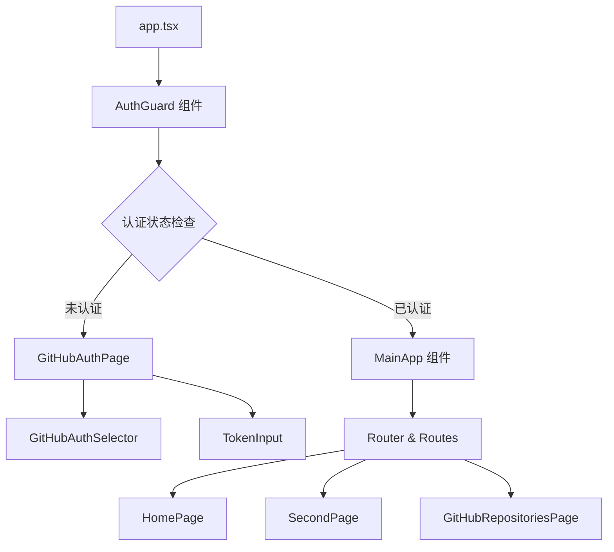
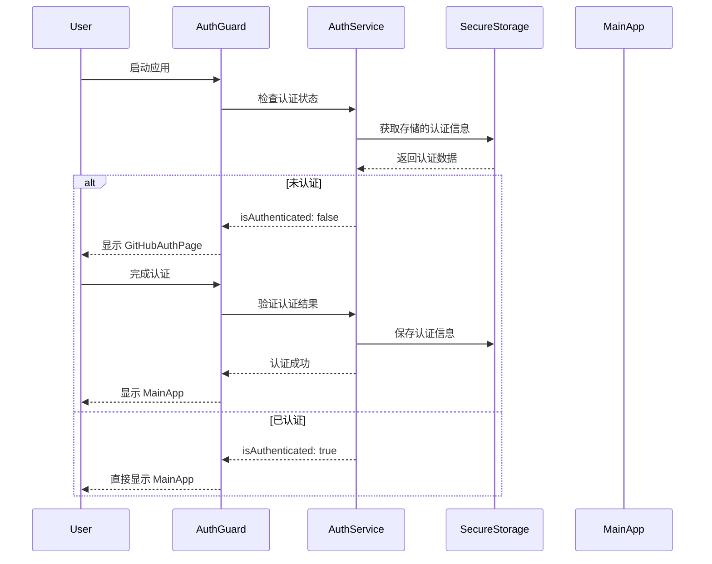
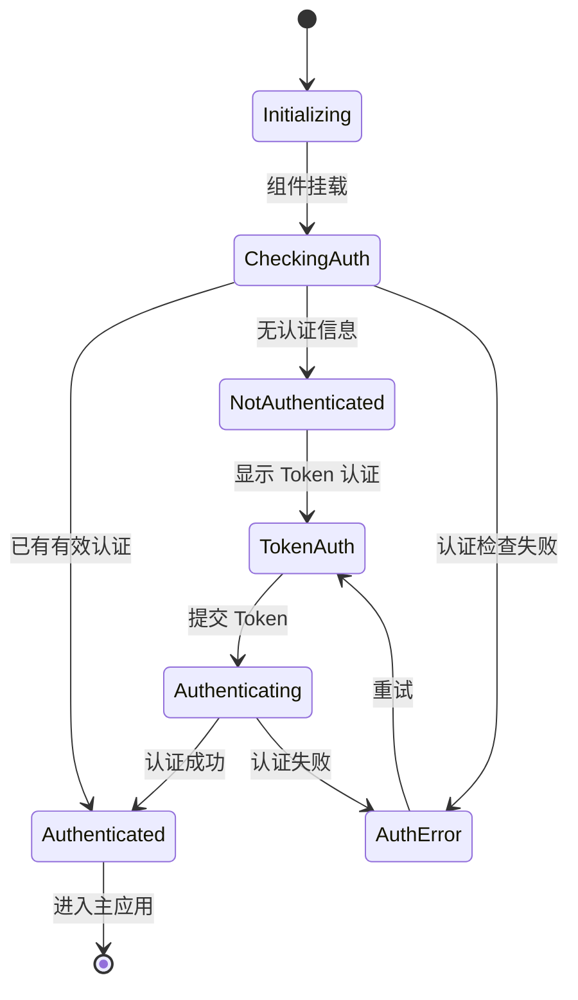

# GitHub 认证引导流程设计

## 概述

为 Starepo Electron 应用添加强制的 GitHub 认证引导流程，确保用户在首次启动应用时完成 GitHub 认证设置，只有认证成功后才能进入主应用界面。

### 目标

- 简化用户首次使用流程，确保必要的认证配置完成
- 提供清晰的认证状态管理和路由控制
- 保持现有认证逻辑的完整性
- 支持认证状态持久化和自动恢复

## 技术架构

### 组件层次结构



### 认证状态流程



## 核心组件设计

### AuthGuard 组件

**职责**: 应用级认证状态管控，决定显示认证页面还是主应用

**状态管理**:

- `authState`: 当前认证状态
- `isLoading`: 认证状态检查中
- `error`: 认证错误信息

**生命周期**:

1. 组件挂载时立即检查认证状态
2. 监听认证状态变化
3. 根据认证状态渲染对应界面

### OnboardingWrapper 组件

**职责**: 引导流程的容器组件，提供统一的布局和状态管理

**特性**:

- 响应式布局适配
- 进度指示器
- 错误处理和重试机制
- 平滑的页面过渡动画

### MainApp 组件

**职责**: 认证后的主应用界面容器

**功能**:

- 包装现有的路由系统
- 提供认证后的全局状态上下文
- 处理认证过期和刷新

## 路由架构重构

### 当前路由结构

```
app.tsx
  └── RouterProvider
      └── Routes
          ├── / (HomePage)
          ├── /second-page
          ├── /github-auth
          └── /github-repositories
```

### 重构后路由结构

```
app.tsx
  └── AuthGuard
      ├── GitHubAuthPage (认证流程)
      └── MainApp (认证后)
          └── RouterProvider
              └── Routes
                  ├── / (HomePage)
                  ├── /second-page
                  └── /github-repositories
```

## 状态管理

### 认证状态接口

```typescript
interface AuthGuardState {
  authState: AuthState | null;
  isLoading: boolean;
  error: string | null;
  hasCheckedAuth: boolean;
}

interface OnboardingState {
  currentStep: AuthStep;
  completedSteps: AuthStep[];
  canProceed: boolean;
}
```

### 状态流转



## 用户体验流程

### 首次启动流程

1. **启动检查** (0.5s)
   - 显示启动画面
   - 后台检查认证状态

2. **认证引导** (1-2 分钟)
   - 显示 Token 认证界面
   - 引导用户输入 Token
   - 实时反馈认证状态

3. **认证成功** (0.5s)
   - 显示成功动画
   - 自动进入主应用

### 后续启动流程

1. **快速启动** (0.2s)
   - 自动验证存储的认证信息
   - 直接进入主应用

2. **认证过期处理**
   - 自动尝试刷新认证
   - 失败时显示重新认证界面

## 错误处理策略

### 认证失败处理

| 错误类型   | 处理策略               | 用户体验                       |
| ---------- | ---------------------- | ------------------------------ |
| Token 无效 | 清除存储，重新引导     | 显示友好错误信息，提供重试按钮 |
| 网络错误   | 保留本地状态，提供重试 | 显示网络错误提示，支持离线模式 |
| 权限不足   | 引导用户创建新 Token   | 解释所需权限，提供创建指南 |
| 服务异常   | 记录错误，提供备选方案 | 显示技术支持信息               |

### 降级策略

1. **网络异常**: 允许使用已缓存的认证信息
2. **服务不可用**: 提供离线模式选项
3. **认证服务异常**: 引导用户稍后重试

## 性能优化

### 认证状态缓存

- **内存缓存**: 应用运行期间保持认证状态
- **持久化存储**: 使用 SecureStorage 安全存储
- **延迟加载**: 按需初始化认证相关服务

### 启动优化

- **并行初始化**: 同时进行认证检查和界面渲染
- **预加载**: 预先加载必要的认证组件
- **分片加载**: 主应用界面延迟加载

## 安全考虑

### 认证信息保护

- 使用 Electron safeStorage API 加密存储
- 内存中的敏感信息及时清理
- 认证状态定期验证和刷新

### 会话管理

- 设置合理的认证过期时间
- 支持主动注销和清理
- 防止认证信息泄露

## 测试策略

### 单元测试

- AuthGuard 组件的状态管理逻辑
- 认证状态检查和切换逻辑
- 错误处理和恢复机制

### 集成测试

- 完整的认证引导流程
- 认证状态持久化和恢复
- Token 认证的验证和错误处理

### 端到端测试

- 首次启动的完整用户流程
- 认证成功后的应用使用
- 认证失败和重试场景

## 实施计划

### 阶段一: 核心架构

- 创建 AuthGuard 组件
- 重构应用启动流程
- 实现基本的认证状态检查

### 阶段二: 用户界面

- 创建 OnboardingWrapper 组件
- 优化认证页面用户体验
- 添加过渡动画和加载状态

### 阶段三: 增强功能

- 实现错误处理和恢复
- 添加性能优化
- 完善测试覆盖

### 阶段四: 用户体验优化

- 细化交互细节
- 添加无障碍支持
- 性能调优和打磨
