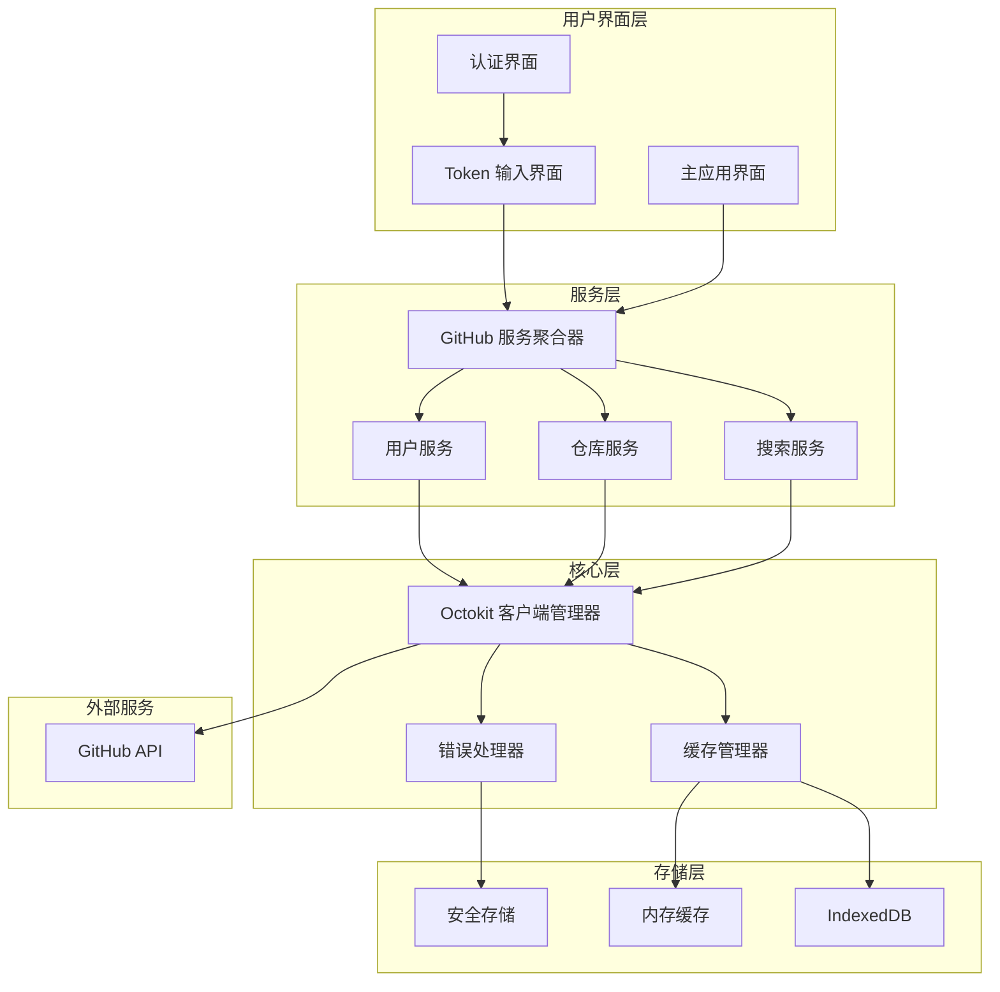

# GitHub 集成功能完整指南

## 概述

本文档提供了 Starepo 应用中 GitHub 集成功能的完整实现指南，包括界面设计、认证流程、技术架构和使用说明。该集成基于 Octokit.js 官方库实现，支持 Personal Access Token 认证方式。

## 功能特性

### 核心功能

- ✅ Personal Access Token 认证
- ✅ 完整的 GitHub API 集成（基于 Octokit.js）
- ✅ 智能缓存和性能优化
- ✅ 错误处理和重试机制
- ✅ 速率限制监控和管理
- ✅ 安全的 Token 存储
- ✅ 响应式用户界面

### 支持的 GitHub 功能

- 用户信息管理
- Star 仓库管理
- 仓库搜索和浏览
- 仓库详细信息查看
- 编程语言统计
- 发布版本查看

## 架构设计

### 整体架构图



## 认证方式详解

### Personal Access Token 认证

#### 界面设计

- Token 输入表单
- 实时验证反馈
- Token 创建指南
- 权限说明

#### 安全考虑

- Token 加密存储
- 输入掩码显示
- 自动验证机制
- 安全清除功能

#### 认证流程

1. 用户输入 Personal Access Token
2. 系统实时验证 Token 有效性
3. 获取用户信息和权限范围
4. 加密存储 Token
5. 认证成功，进入主应用

## 技术架构详解

### 1. Octokit.js 集成

#### 客户端初始化

```typescript
const MyOctokit = Octokit.plugin(throttling, retry);

const octokit = new MyOctokit({
  auth: token,
  userAgent: "Starepo/1.0.0",
  throttle: {
    onRateLimit: handleRateLimit,
    onSecondaryRateLimit: handleSecondaryRateLimit,
  },
  retry: {
    doNotRetry: ["400", "401", "403", "404", "422"],
  },
});
```

#### 服务层设计

```typescript
export class GitHubService {
  private userService: GitHubUserService;
  private repositoryService: GitHubRepositoryService;

  async initialize(config: GitHubServiceConfig) {
    await this.octokitManager.initialize(config);
    this.userService = new GitHubUserService();
    this.repositoryService = new GitHubRepositoryService();
  }

  get user() {
    return this.userService;
  }
  get repository() {
    return this.repositoryService;
  }
}
```

### 2. 缓存策略

#### 多层缓存架构

- **内存缓存**：快速访问，存储热点数据
- **IndexedDB**：持久化存储，大数据缓存
- **智能清理**：LRU 算法，定期清理过期数据

#### 缓存配置

```typescript
const CACHE_CONFIG = {
  user: { ttl: 600 }, // 用户信息 10 分钟
  repos: { ttl: 300 }, // 仓库列表 5 分钟
  search: { ttl: 600 }, // 搜索结果 10 分钟
  details: { ttl: 1800 }, // 详细信息 30 分钟
};
```

### 3. 错误处理

#### 错误分类

```typescript
type ErrorType =
  | "auth" // 认证错误
  | "network" // 网络错误
  | "rate-limit" // 速率限制
  | "permission" // 权限错误
  | "unknown"; // 未知错误
```

#### 重试策略

- 指数退避算法
- 智能重试判断
- 最大重试次数限制
- 用户友好的错误提示

### 4. 性能优化

#### 请求优化

- 请求去重
- 批量请求
- 分页优化
- 预加载机制

#### 渲染优化

- 虚拟滚动
- 懒加载
- 防抖节流
- 组件缓存

## 用户界面设计

### 1. 认证界面

```jsx
const AuthInterface = () => {
  return (
    <div className="auth-interface">
      <div className="auth-header">
        <GitHubIcon size={48} />
        <h2>连接到 GitHub</h2>
        <p>使用 Personal Access Token 访问您的 GitHub 账户</p>
      </div>
      
      <TokenInputForm />
    </div>
  );
};
```

### 2. Token 输入界面

```jsx
const TokenAuth = () => {
  const [token, setToken] = useState("");
  const [isValidating, setIsValidating] = useState(false);
  const [validationResult, setValidationResult] = useState(null);

  return (
    <div className="token-auth">
      <div className="token-input-section">
        <Label htmlFor="token">Personal Access Token</Label>
        <Input
          id="token"
          type="password"
          value={token}
          onChange={(e) => setToken(e.target.value)}
          placeholder="ghp_xxxxxxxxxxxxxxxxxxxx"
        />

        {validationResult && <ValidationFeedback result={validationResult} />}
      </div>

      <TokenGuide />

      <div className="auth-actions">
        <Button onClick={validateToken} disabled={!token || isValidating}>
          {isValidating ? "验证中..." : "验证并连接"}
        </Button>
      </div>
    </div>
  );
};
```

### 4. 速率限制监控

```jsx
const RateLimitMonitor = () => {
  const [rateLimitInfo, setRateLimitInfo] = useState(null);

  return (
    <div className="rate-limit-monitor">
      <div className="rate-limit-header">
        <span>API 使用情况</span>
        <Badge variant={getStatusVariant(rateLimitInfo)}>
          {rateLimitInfo?.remaining || 0} / {rateLimitInfo?.limit || 0}
        </Badge>
      </div>

      <Progress
        value={(rateLimitInfo?.remaining / rateLimitInfo?.limit) * 100}
        className="rate-limit-progress"
      />

      {rateLimitInfo?.remaining < rateLimitInfo?.limit * 0.2 && (
        <Alert variant="warning">API 调用次数即将用完，请注意使用频率</Alert>
      )}
    </div>
  );
};
```

## 安全考虑

### 1. Token 安全存储

```typescript
class SecureStorage {
  private static encrypt(data: string): string {
    // 使用 Electron 的 safeStorage API
    return safeStorage.encryptString(data);
  }

  private static decrypt(encryptedData: string): string {
    return safeStorage.decryptString(Buffer.from(encryptedData, "base64"));
  }

  static setToken(token: string): void {
    const encrypted = this.encrypt(token);
    localStorage.setItem("github_token", encrypted);
  }

  static getToken(): string | null {
    const encrypted = localStorage.getItem("github_token");
    return encrypted ? this.decrypt(encrypted) : null;
  }
}
```


### 3. Token 权限验证

```typescript
const validateTokenPermissions = async (
  token: string,
): Promise<{
  valid: boolean;
  permissions: string[];
  user: any;
}> => {
  try {
    const octokit = new Octokit({ auth: token });
    const userResponse = await octokit.rest.users.getAuthenticated();

    // 检查 Token 权限
    const scopes = userResponse.headers["x-oauth-scopes"]?.split(", ") || [];

    return {
      valid: true,
      permissions: scopes,
      user: userResponse.data,
    };
  } catch (error) {
    return {
      valid: false,
      permissions: [],
      user: null,
    };
  }
};
```

## 使用指南

### 1. Personal Access Token 创建

#### 步骤说明

1. 访问 GitHub Settings > Developer settings > Personal access tokens
2. 点击 "Generate new token (classic)"
3. 设置 Token 名称和过期时间
4. 选择必要的权限范围：
   - `user`: 读取用户信息
   - `repo`: 访问仓库（如需要私有仓库）
   - `read:org`: 读取组织信息
5. 生成并复制 Token

#### 权限说明

- **user**: 获取用户基本信息、邮箱等
- **repo**: 访问公共和私有仓库
- **read:org**: 读取用户所属组织信息
- **gist**: 访问 Gist（可选）

### 2. 集成使用示例

#### 初始化 GitHub 服务

```typescript
import { githubService } from "@/services/github/github-service";

// Token 认证
const initWithToken = async (token: string) => {
  await githubService.initialize({
    authMethod: "token",
    token,
  });
};
```

#### 获取用户信息

```typescript
const getUserInfo = async () => {
  try {
    const response = await githubService.user.getCurrentUser();
    console.log("用户信息:", response.data);
  } catch (error) {
    console.error("获取用户信息失败:", error);
  }
};
```

#### 获取 Star 仓库

```typescript
const getStarredRepos = async () => {
  try {
    const response = await githubService.repository.getStarredRepositories();
    console.log("Star 仓库:", response.data);
  } catch (error) {
    console.error("获取 Star 仓库失败:", error);
  }
};
```

#### 搜索仓库

```typescript
const searchRepos = async (query: string) => {
  try {
    const response = await githubService.repository.searchRepositories({
      query,
      sort: "stars",
      order: "desc",
    });
    console.log("搜索结果:", response.data);
  } catch (error) {
    console.error("搜索失败:", error);
  }
};
```

## 测试策略

### 1. 单元测试

```typescript
// tests/services/github-service.test.ts
describe("GitHubService", () => {
  let service: GitHubService;

  beforeEach(() => {
    service = GitHubService.getInstance();
  });

  describe("initialize", () => {
    it("should initialize with valid token", async () => {
      await expect(
        service.initialize({
          authMethod: "token",
          token: "valid_token",
        }),
      ).resolves.not.toThrow();
    });

    it("should throw error with invalid token", async () => {
      await expect(
        service.initialize({
          authMethod: "token",
          token: "invalid_token",
        }),
      ).rejects.toThrow();
    });
  });
});
```

### 2. 集成测试

```typescript
// tests/integration/github-integration.test.ts
describe("GitHub Integration", () => {
  it("should validate token and get user info", async () => {
    const result = await validateTokenPermissions("mock_token");
    expect(result.valid).toBe(true);
    expect(result.user).toBeDefined();
  });
});
```

### 3. E2E 测试

```typescript
// tests/e2e/auth-flow.test.ts
describe("Authentication Flow", () => {
  it("should complete token authentication", async () => {
    await page.goto("/auth");
    await page.fill('[data-testid="token-input"]', "mock_token");
    await page.click('[data-testid="submit-button"]');

    // 验证认证成功
    await expect(page.locator('[data-testid="user-info"]')).toBeVisible();
  });
});
```

## 部署和监控

### 1. 生产环境配置

```javascript
// config/production.js
module.exports = {
  github: {
    baseUrl: "https://api.github.com",
    timeout: 10000,
    retryCount: 3,
  },
  cache: {
    defaultTTL: 300,
    maxMemoryItems: 1000,
    enablePersistent: true,
  },
};
```

### 2. 错误监控

```typescript
// utils/error-monitoring.ts
export const reportError = (error: Error, context: any) => {
  // 发送到错误监控服务
  console.error("GitHub Integration Error:", {
    message: error.message,
    stack: error.stack,
    context,
    timestamp: new Date().toISOString(),
  });
};
```

### 3. 性能监控

```typescript
// utils/performance-monitoring.ts
export const trackApiCall = (
  endpoint: string,
  duration: number,
  success: boolean,
) => {
  // 记录 API 调用性能
  console.log("API Call Metrics:", {
    endpoint,
    duration,
    success,
    timestamp: new Date().toISOString(),
  });
};
```

## 故障排除

### 常见问题

1. **认证失败**
   - 检查 Token 是否有效
   - 验证权限范围是否足够
   - 确认网络连接正常

2. **API 调用失败**
   - 检查速率限制状态
   - 验证请求参数格式
   - 查看错误日志详情

3. **缓存问题**
   - 清除过期缓存
   - 检查存储空间
   - 验证缓存键格式

### 调试工具

```typescript
// utils/debug.ts
export const debugGitHubService = () => {
  const service = GitHubService.getInstance();
  const status = service.getStatus();

  console.log("GitHub Service Debug Info:", {
    isInitialized: status.isInitialized,
    clientStatus: status.clientStatus,
    cacheStats: status.cacheStats,
    rateLimitInfo: service.client.getRateLimitInfo(),
  });
};
```

## 总结

本文档提供了 Starepo 应用中 GitHub 集成功能的完整实现指南，涵盖了从界面设计到技术架构的各个方面。通过遵循本指南，开发者可以：

1. 实现安全可靠的 GitHub 认证
2. 构建高性能的 API 集成
3. 提供优秀的用户体验
4. 确保应用的稳定性和可维护性

该集成方案具有以下优势：

- 🔒 **安全性**：多重安全保护措施
- 🚀 **性能**：智能缓存和优化策略
- 🛠️ **可维护性**：清晰的架构和代码组织
- 📱 **用户体验**：直观的界面和流畅的交互
- 🔧 **可扩展性**：模块化设计，易于扩展新功能

## 参考资源

- [Octokit.js 官方文档](https://github.com/octokit/octokit.js)
- [GitHub REST API 文档](https://docs.github.com/en/rest)
- [Personal Access Tokens 文档](https://docs.github.com/en/authentication/keeping-your-account-and-data-secure/managing-your-personal-access-tokens)
- [Electron 安全指南](https://www.electronjs.org/docs/tutorial/security)
- [React 性能优化指南](https://react.dev/learn/render-and-commit)

---

_本文档版本：v1.0.0_  
_最后更新：2024年1月_  
_维护者：Starepo 开发团队_
