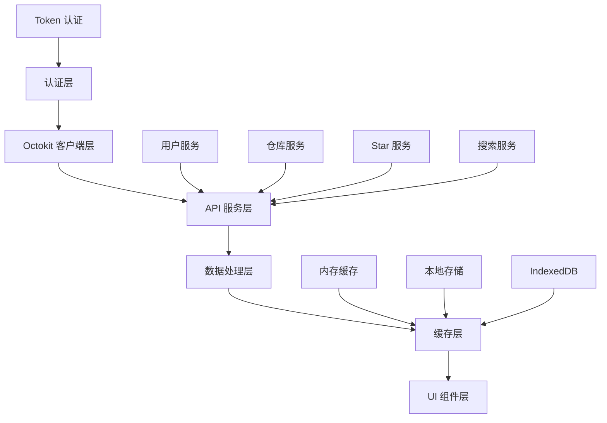

# Octokit.js 集成架构设计

## 概述

本文档描述了 StarRepo 应用中 Octokit.js 的集成架构，包括客户端初始化、API 调用封装、错误处理、重试机制和缓存策略。基于官方文档 <mcreference link="https://github.com/octokit/octokit.js" index="0">0</mcreference>，我们将实现一个完整的 GitHub API 集成方案。

## 架构设计

### 整体架构图



## 核心组件设计

### 1. Octokit 客户端管理器

```typescript
// src/renderer/services/github/octokit-manager.ts
import { Octokit } from "octokit";
import { throttling } from "@octokit/plugin-throttling";
import { retry } from "@octokit/plugin-retry";
import { createTokenAuth } from "@octokit/auth-token";

// 扩展 Octokit 功能
const MyOctokit = Octokit.plugin(throttling, retry);

export interface GitHubClientConfig {
  authMethod: "token";
  token?: string;
  baseUrl?: string;
  userAgent?: string;
  timeout?: number;
}

export interface RateLimitInfo {
  limit: number;
  remaining: number;
  reset: Date;
  used: number;
}

export class OctokitManager {
  private static instance: OctokitManager;
  private octokit: Octokit | null = null;
  private config: GitHubClientConfig | null = null;
  private rateLimitInfo: RateLimitInfo | null = null;
  private isInitialized = false;

  private constructor() {}

  static getInstance(): OctokitManager {
    if (!OctokitManager.instance) {
      OctokitManager.instance = new OctokitManager();
    }
    return OctokitManager.instance;
  }

  // 初始化 Octokit 客户端
  async initialize(config: GitHubClientConfig): Promise<void> {
    try {
      this.config = config;

      const octokitConfig: any = {
        userAgent: config.userAgent || "StarRepo/1.0.0",
        baseUrl: config.baseUrl || "https://api.github.com",
        request: {
          timeout: config.timeout || 10000,
        },
        throttle: {
          onRateLimit: this.handleRateLimit.bind(this),
          onSecondaryRateLimit: this.handleSecondaryRateLimit.bind(this),
        },
        retry: {
          doNotRetry: ["400", "401", "403", "404", "422"],
        },
      };

      // 设置认证
      if (config.token) {
        octokitConfig.auth = config.token;
      }

      this.octokit = new MyOctokit(octokitConfig);

      // 验证客户端
      await this.validateClient();

      this.isInitialized = true;
      console.log("Octokit 客户端初始化成功");
    } catch (error) {
      console.error("Octokit 客户端初始化失败:", error);
      throw new Error(`GitHub 客户端初始化失败: ${error.message}`);
    }
  }

  // 获取 Octokit 实例
  getClient(): Octokit {
    if (!this.isInitialized || !this.octokit) {
      throw new Error("Octokit 客户端未初始化");
    }
    return this.octokit;
  }

  // 验证客户端连接
  private async validateClient(): Promise<void> {
    if (!this.octokit) throw new Error("客户端未初始化");

    try {
      const response = await this.octokit.rest.users.getAuthenticated();
      console.log(`已连接到 GitHub，用户: ${response.data.login}`);

      // 更新速率限制信息
      this.updateRateLimitInfo(response.headers);
    } catch (error) {
      if (error.status === 401) {
        throw new Error("GitHub 认证失败，请检查 Token 是否有效");
      } else if (error.status === 403) {
        throw new Error("GitHub API 访问被拒绝，可能是权限不足或速率限制");
      } else {
        throw new Error(`GitHub API 连接失败: ${error.message}`);
      }
    }
  }

  // 处理速率限制
  private handleRateLimit(
    retryAfter: number,
    options: any,
    octokit: Octokit,
  ): boolean {
    console.warn(`GitHub API 速率限制触发，${retryAfter} 秒后重试`);

    // 通知 UI 显示速率限制警告
    window.dispatchEvent(
      new CustomEvent("github-rate-limit", {
        detail: { retryAfter, type: "primary" },
      }),
    );

    // 只重试一次
    if (options.request.retryCount === 0) {
      console.log(`将在 ${retryAfter} 秒后重试请求`);
      return true;
    }

    return false;
  }

  // 处理次要速率限制
  private handleSecondaryRateLimit(
    retryAfter: number,
    options: any,
    octokit: Octokit,
  ): boolean {
    console.warn(`GitHub API 次要速率限制触发，${retryAfter} 秒后重试`);

    window.dispatchEvent(
      new CustomEvent("github-rate-limit", {
        detail: { retryAfter, type: "secondary" },
      }),
    );

    return true; // 总是重试次要速率限制
  }

  // 更新速率限制信息
  private updateRateLimitInfo(headers: any): void {
    const limit = parseInt(headers["x-ratelimit-limit"] || "0");
    const remaining = parseInt(headers["x-ratelimit-remaining"] || "0");
    const reset = new Date(
      parseInt(headers["x-ratelimit-reset"] || "0") * 1000,
    );
    const used = parseInt(headers["x-ratelimit-used"] || "0");

    this.rateLimitInfo = { limit, remaining, reset, used };

    // 通知 UI 更新速率限制显示
    window.dispatchEvent(
      new CustomEvent("github-rate-limit-update", {
        detail: this.rateLimitInfo,
      }),
    );
  }

  // 获取速率限制信息
  getRateLimitInfo(): RateLimitInfo | null {
    return this.rateLimitInfo;
  }

  // 检查是否接近速率限制
  isNearRateLimit(): boolean {
    if (!this.rateLimitInfo) return false;
    return this.rateLimitInfo.remaining < this.rateLimitInfo.limit * 0.1; // 剩余不足 10%
  }

  // 重置客户端
  reset(): void {
    this.octokit = null;
    this.config = null;
    this.rateLimitInfo = null;
    this.isInitialized = false;
  }

  // 更新认证信息
  async updateAuth(token: string): Promise<void> {
    if (!this.config) throw new Error("客户端未配置");

    this.config.token = token;
    await this.initialize(this.config);
  }

  // 获取客户端状态
  getStatus(): {
    isInitialized: boolean;
    authMethod: string | null;
    rateLimitInfo: RateLimitInfo | null;
  } {
    return {
      isInitialized: this.isInitialized,
      authMethod: this.config?.authMethod || null,
      rateLimitInfo: this.rateLimitInfo,
    };
  }
}
```

### 2. API 服务基类

```typescript
// src/renderer/services/github/base-service.ts
import { Octokit } from "octokit";
import { OctokitManager } from "./octokit-manager";
import { CacheManager } from "./cache-manager";

export interface ApiRequestOptions {
  useCache?: boolean;
  cacheKey?: string;
  cacheTTL?: number; // 缓存时间（秒）
  retryCount?: number;
  timeout?: number;
}

export interface PaginationOptions {
  page?: number;
  per_page?: number;
  maxPages?: number;
}

export interface ApiResponse<T> {
  data: T;
  status: number;
  headers: any;
  fromCache?: boolean;
}

export abstract class BaseGitHubService {
  protected octokit: Octokit;
  protected cacheManager: CacheManager;

  constructor() {
    this.octokit = OctokitManager.getInstance().getClient();
    this.cacheManager = CacheManager.getInstance();
  }

  // 执行 API 请求
  protected async executeRequest<T>(
    requestFn: () => Promise<any>,
    options: ApiRequestOptions = {},
  ): Promise<ApiResponse<T>> {
    const {
      useCache = true,
      cacheKey,
      cacheTTL = 300, // 默认 5 分钟缓存
      retryCount = 3,
    } = options;

    // 检查缓存
    if (useCache && cacheKey) {
      const cachedData = await this.cacheManager.get<T>(cacheKey);
      if (cachedData) {
        return {
          data: cachedData,
          status: 200,
          headers: {},
          fromCache: true,
        };
      }
    }

    // 执行请求
    let lastError: Error | null = null;
    for (let i = 0; i < retryCount; i++) {
      try {
        const response = await requestFn();

        // 缓存结果
        if (useCache && cacheKey && response.data) {
          await this.cacheManager.set(cacheKey, response.data, cacheTTL);
        }

        return {
          data: response.data,
          status: response.status,
          headers: response.headers,
          fromCache: false,
        };
      } catch (error) {
        lastError = error;

        // 不重试的错误类型
        if (this.shouldNotRetry(error)) {
          break;
        }

        // 等待后重试
        if (i < retryCount - 1) {
          await this.delay(Math.pow(2, i) * 1000); // 指数退避
        }
      }
    }

    throw this.handleError(lastError);
  }

  // 分页请求
  protected async executePaginatedRequest<T>(
    requestFn: (page: number, perPage: number) => Promise<any>,
    options: PaginationOptions & ApiRequestOptions = {},
  ): Promise<ApiResponse<T[]>> {
    const {
      page = 1,
      per_page = 30,
      maxPages = 10,
      useCache = true,
      cacheKey,
      cacheTTL = 300,
    } = options;

    // 检查缓存
    if (useCache && cacheKey) {
      const cachedData = await this.cacheManager.get<T[]>(cacheKey);
      if (cachedData) {
        return {
          data: cachedData,
          status: 200,
          headers: {},
          fromCache: true,
        };
      }
    }

    const allData: T[] = [];
    let currentPage = page;
    let hasNextPage = true;

    while (hasNextPage && currentPage <= maxPages) {
      try {
        const response = await requestFn(currentPage, per_page);
        allData.push(...response.data);

        // 检查是否有下一页
        hasNextPage = response.data.length === per_page;
        currentPage++;
      } catch (error) {
        if (currentPage === page) {
          // 第一页失败，抛出错误
          throw this.handleError(error);
        } else {
          // 后续页面失败，返回已获取的数据
          console.warn(`分页请求在第 ${currentPage} 页失败:`, error);
          break;
        }
      }
    }

    // 缓存结果
    if (useCache && cacheKey && allData.length > 0) {
      await this.cacheManager.set(cacheKey, allData, cacheTTL);
    }

    return {
      data: allData,
      status: 200,
      headers: {},
      fromCache: false,
    };
  }

  // 判断是否应该重试
  private shouldNotRetry(error: any): boolean {
    const noRetryStatuses = [400, 401, 403, 404, 422];
    return noRetryStatuses.includes(error.status);
  }

  // 延迟函数
  private delay(ms: number): Promise<void> {
    return new Promise((resolve) => setTimeout(resolve, ms));
  }

  // 错误处理
  private handleError(error: any): Error {
    if (!error) return new Error("未知错误");

    const status = error.status || error.response?.status;
    const message = error.message || "请求失败";

    switch (status) {
      case 401:
        return new Error("GitHub 认证失败，请重新登录");
      case 403:
        if (error.message?.includes("rate limit")) {
          return new Error("GitHub API 速率限制，请稍后重试");
        }
        return new Error("GitHub API 访问被拒绝，权限不足");
      case 404:
        return new Error("请求的资源不存在");
      case 422:
        return new Error("请求参数无效");
      case 500:
        return new Error("GitHub 服务器内部错误");
      case 502:
      case 503:
      case 504:
        return new Error("GitHub 服务暂时不可用，请稍后重试");
      default:
        return new Error(`GitHub API 错误: ${message}`);
    }
  }

  // 生成缓存键
  protected generateCacheKey(prefix: string, params: any): string {
    const paramString = JSON.stringify(params, Object.keys(params).sort());
    return `${prefix}:${btoa(paramString)}`;
  }
}
```

### 3. 用户服务

```typescript
// src/renderer/services/github/user-service.ts
import { BaseGitHubService, ApiResponse } from "./base-service";

export interface GitHubUser {
  login: string;
  id: number;
  name: string | null;
  email: string | null;
  avatar_url: string;
  bio: string | null;
  company: string | null;
  location: string | null;
  blog: string | null;
  twitter_username: string | null;
  public_repos: number;
  public_gists: number;
  followers: number;
  following: number;
  created_at: string;
  updated_at: string;
}

export interface GitHubUserEmail {
  email: string;
  primary: boolean;
  verified: boolean;
  visibility: string | null;
}

export class GitHubUserService extends BaseGitHubService {
  // 获取当前认证用户信息
  async getCurrentUser(): Promise<ApiResponse<GitHubUser>> {
    return this.executeRequest<GitHubUser>(
      () => this.octokit.rest.users.getAuthenticated(),
      {
        cacheKey: "user:current",
        cacheTTL: 600, // 10 分钟缓存
      },
    );
  }

  // 获取用户邮箱列表
  async getUserEmails(): Promise<ApiResponse<GitHubUserEmail[]>> {
    return this.executeRequest<GitHubUserEmail[]>(
      () => this.octokit.rest.users.listEmailsForAuthenticatedUser(),
      {
        cacheKey: "user:emails",
        cacheTTL: 3600, // 1 小时缓存
      },
    );
  }

  // 获取指定用户信息
  async getUser(username: string): Promise<ApiResponse<GitHubUser>> {
    return this.executeRequest<GitHubUser>(
      () => this.octokit.rest.users.getByUsername({ username }),
      {
        cacheKey: `user:${username}`,
        cacheTTL: 1800, // 30 分钟缓存
      },
    );
  }

  // 检查用户是否关注了指定用户
  async isFollowing(username: string): Promise<ApiResponse<boolean>> {
    try {
      await this.octokit.rest.users.checkPersonIsFollowedByAuthenticated({
        username,
      });
      return {
        data: true,
        status: 204,
        headers: {},
      };
    } catch (error) {
      if (error.status === 404) {
        return {
          data: false,
          status: 404,
          headers: {},
        };
      }
      throw this.handleError(error);
    }
  }

  // 关注用户
  async followUser(username: string): Promise<ApiResponse<void>> {
    return this.executeRequest<void>(
      () => this.octokit.rest.users.follow({ username }),
      { useCache: false },
    );
  }

  // 取消关注用户
  async unfollowUser(username: string): Promise<ApiResponse<void>> {
    return this.executeRequest<void>(
      () => this.octokit.rest.users.unfollow({ username }),
      { useCache: false },
    );
  }
}
```

### 4. 仓库服务

```typescript
// src/renderer/services/github/repository-service.ts
import {
  BaseGitHubService,
  ApiResponse,
  PaginationOptions,
} from "./base-service";

export interface GitHubRepository {
  id: number;
  name: string;
  full_name: string;
  description: string | null;
  html_url: string;
  clone_url: string;
  ssh_url: string;
  homepage: string | null;
  language: string | null;
  languages_url: string;
  stargazers_count: number;
  watchers_count: number;
  forks_count: number;
  open_issues_count: number;
  size: number;
  default_branch: string;
  topics: string[];
  license: {
    key: string;
    name: string;
    spdx_id: string;
  } | null;
  owner: {
    login: string;
    id: number;
    avatar_url: string;
    type: string;
  };
  private: boolean;
  fork: boolean;
  archived: boolean;
  disabled: boolean;
  pushed_at: string;
  created_at: string;
  updated_at: string;
}

export interface RepositorySearchOptions {
  query: string;
  sort?: "stars" | "forks" | "help-wanted-issues" | "updated";
  order?: "asc" | "desc";
  language?: string;
  topic?: string;
  user?: string;
  org?: string;
}

export class GitHubRepositoryService extends BaseGitHubService {
  // 获取用户的 starred 仓库
  async getStarredRepositories(
    username?: string,
    options: PaginationOptions = {},
  ): Promise<ApiResponse<GitHubRepository[]>> {
    const cacheKey = this.generateCacheKey("starred", { username, ...options });

    return this.executePaginatedRequest<GitHubRepository>(
      (page, per_page) => {
        if (username) {
          return this.octokit.rest.activity.listReposStarredByUser({
            username,
            page,
            per_page,
          });
        } else {
          return this.octokit.rest.activity.listReposStarredByAuthenticatedUser(
            {
              page,
              per_page,
            },
          );
        }
      },
      {
        ...options,
        cacheKey,
        cacheTTL: 300, // 5 分钟缓存
      },
    );
  }

  // 获取仓库详细信息
  async getRepository(
    owner: string,
    repo: string,
  ): Promise<ApiResponse<GitHubRepository>> {
    return this.executeRequest<GitHubRepository>(
      () => this.octokit.rest.repos.get({ owner, repo }),
      {
        cacheKey: `repo:${owner}/${repo}`,
        cacheTTL: 600, // 10 分钟缓存
      },
    );
  }

  // 检查是否已 star 仓库
  async isRepositoryStarred(
    owner: string,
    repo: string,
  ): Promise<ApiResponse<boolean>> {
    try {
      await this.octokit.rest.activity.checkRepoIsStarredByAuthenticatedUser({
        owner,
        repo,
      });
      return {
        data: true,
        status: 204,
        headers: {},
      };
    } catch (error) {
      if (error.status === 404) {
        return {
          data: false,
          status: 404,
          headers: {},
        };
      }
      throw error;
    }
  }

  // Star 仓库
  async starRepository(
    owner: string,
    repo: string,
  ): Promise<ApiResponse<void>> {
    const response = await this.executeRequest<void>(
      () =>
        this.octokit.rest.activity.starRepoForAuthenticatedUser({
          owner,
          repo,
        }),
      { useCache: false },
    );

    // 清除相关缓存
    await this.cacheManager.invalidatePattern("starred:*");

    return response;
  }

  // 取消 Star 仓库
  async unstarRepository(
    owner: string,
    repo: string,
  ): Promise<ApiResponse<void>> {
    const response = await this.executeRequest<void>(
      () =>
        this.octokit.rest.activity.unstarRepoForAuthenticatedUser({
          owner,
          repo,
        }),
      { useCache: false },
    );

    // 清除相关缓存
    await this.cacheManager.invalidatePattern("starred:*");

    return response;
  }

  // 搜索仓库
  async searchRepositories(
    options: RepositorySearchOptions,
    paginationOptions: PaginationOptions = {},
  ): Promise<ApiResponse<{ total_count: number; items: GitHubRepository[] }>> {
    const {
      query,
      sort = "stars",
      order = "desc",
      language,
      topic,
      user,
      org,
    } = options;

    // 构建搜索查询
    let searchQuery = query;
    if (language) searchQuery += ` language:${language}`;
    if (topic) searchQuery += ` topic:${topic}`;
    if (user) searchQuery += ` user:${user}`;
    if (org) searchQuery += ` org:${org}`;

    const cacheKey = this.generateCacheKey("search:repos", {
      q: searchQuery,
      sort,
      order,
      ...paginationOptions,
    });

    return this.executeRequest<{
      total_count: number;
      items: GitHubRepository[];
    }>(
      () =>
        this.octokit.rest.search.repos({
          q: searchQuery,
          sort,
          order,
          page: paginationOptions.page || 1,
          per_page: paginationOptions.per_page || 30,
        }),
      {
        cacheKey,
        cacheTTL: 600, // 10 分钟缓存
      },
    );
  }

  // 获取仓库的编程语言统计
  async getRepositoryLanguages(
    owner: string,
    repo: string,
  ): Promise<ApiResponse<Record<string, number>>> {
    return this.executeRequest<Record<string, number>>(
      () => this.octokit.rest.repos.listLanguages({ owner, repo }),
      {
        cacheKey: `repo:${owner}/${repo}:languages`,
        cacheTTL: 3600, // 1 小时缓存
      },
    );
  }

  // 获取仓库的 README
  async getRepositoryReadme(
    owner: string,
    repo: string,
  ): Promise<ApiResponse<{ content: string; encoding: string }>> {
    return this.executeRequest<{ content: string; encoding: string }>(
      () => this.octokit.rest.repos.getReadme({ owner, repo }),
      {
        cacheKey: `repo:${owner}/${repo}:readme`,
        cacheTTL: 1800, // 30 分钟缓存
      },
    );
  }

  // 获取仓库的发布版本
  async getRepositoryReleases(
    owner: string,
    repo: string,
    options: PaginationOptions = {},
  ): Promise<ApiResponse<any[]>> {
    const cacheKey = this.generateCacheKey("releases", {
      owner,
      repo,
      ...options,
    });

    return this.executePaginatedRequest(
      (page, per_page) =>
        this.octokit.rest.repos.listReleases({
          owner,
          repo,
          page,
          per_page,
        }),
      {
        ...options,
        cacheKey,
        cacheTTL: 1800, // 30 分钟缓存
      },
    );
  }
}
```

### 5. 缓存管理器

```typescript
// src/renderer/services/github/cache-manager.ts
export interface CacheItem<T> {
  data: T;
  timestamp: number;
  ttl: number;
}

export class CacheManager {
  private static instance: CacheManager;
  private memoryCache = new Map<string, CacheItem<any>>();
  private readonly MAX_MEMORY_ITEMS = 1000;

  private constructor() {
    // 定期清理过期缓存
    setInterval(() => this.cleanupExpiredItems(), 60000); // 每分钟清理一次
  }

  static getInstance(): CacheManager {
    if (!CacheManager.instance) {
      CacheManager.instance = new CacheManager();
    }
    return CacheManager.instance;
  }

  // 设置缓存
  async set<T>(key: string, data: T, ttlSeconds: number): Promise<void> {
    const item: CacheItem<T> = {
      data,
      timestamp: Date.now(),
      ttl: ttlSeconds * 1000,
    };

    // 内存缓存
    this.memoryCache.set(key, item);

    // 如果内存缓存过大，清理最旧的项目
    if (this.memoryCache.size > this.MAX_MEMORY_ITEMS) {
      this.cleanupOldestItems();
    }

    // 持久化缓存（用于大数据）
    if (this.shouldPersist(data)) {
      await this.setPersistent(key, item);
    }
  }

  // 获取缓存
  async get<T>(key: string): Promise<T | null> {
    // 先检查内存缓存
    const memoryItem = this.memoryCache.get(key);
    if (memoryItem && !this.isExpired(memoryItem)) {
      return memoryItem.data;
    }

    // 检查持久化缓存
    const persistentItem = await this.getPersistent<T>(key);
    if (persistentItem && !this.isExpired(persistentItem)) {
      // 重新加载到内存缓存
      this.memoryCache.set(key, persistentItem);
      return persistentItem.data;
    }

    return null;
  }

  // 删除缓存
  async delete(key: string): Promise<void> {
    this.memoryCache.delete(key);
    await this.deletePersistent(key);
  }

  // 清除所有缓存
  async clear(): Promise<void> {
    this.memoryCache.clear();
    await this.clearPersistent();
  }

  // 根据模式删除缓存
  async invalidatePattern(pattern: string): Promise<void> {
    const regex = new RegExp(pattern.replace("*", ".*"));

    // 清理内存缓存
    for (const key of this.memoryCache.keys()) {
      if (regex.test(key)) {
        this.memoryCache.delete(key);
      }
    }

    // 清理持久化缓存
    await this.invalidatePersistentPattern(pattern);
  }

  // 检查项目是否过期
  private isExpired(item: CacheItem<any>): boolean {
    return Date.now() - item.timestamp > item.ttl;
  }

  // 清理过期项目
  private cleanupExpiredItems(): void {
    for (const [key, item] of this.memoryCache.entries()) {
      if (this.isExpired(item)) {
        this.memoryCache.delete(key);
      }
    }
  }

  // 清理最旧的项目
  private cleanupOldestItems(): void {
    const entries = Array.from(this.memoryCache.entries()).sort(
      ([, a], [, b]) => a.timestamp - b.timestamp,
    );

    const itemsToRemove = entries.slice(
      0,
      Math.floor(this.MAX_MEMORY_ITEMS * 0.1),
    );
    for (const [key] of itemsToRemove) {
      this.memoryCache.delete(key);
    }
  }

  // 判断是否需要持久化
  private shouldPersist(data: any): boolean {
    const dataSize = JSON.stringify(data).length;
    return dataSize > 10000; // 大于 10KB 的数据持久化
  }

  // 持久化缓存操作
  private async setPersistent<T>(
    key: string,
    item: CacheItem<T>,
  ): Promise<void> {
    try {
      const db = await this.getIndexedDB();
      const transaction = db.transaction(["cache"], "readwrite");
      const store = transaction.objectStore("cache");
      await store.put({ key, ...item });
    } catch (error) {
      console.warn("持久化缓存设置失败:", error);
    }
  }

  private async getPersistent<T>(key: string): Promise<CacheItem<T> | null> {
    try {
      const db = await this.getIndexedDB();
      const transaction = db.transaction(["cache"], "readonly");
      const store = transaction.objectStore("cache");
      const result = await store.get(key);

      if (result) {
        return {
          data: result.data,
          timestamp: result.timestamp,
          ttl: result.ttl,
        };
      }
    } catch (error) {
      console.warn("持久化缓存读取失败:", error);
    }

    return null;
  }

  private async deletePersistent(key: string): Promise<void> {
    try {
      const db = await this.getIndexedDB();
      const transaction = db.transaction(["cache"], "readwrite");
      const store = transaction.objectStore("cache");
      await store.delete(key);
    } catch (error) {
      console.warn("持久化缓存删除失败:", error);
    }
  }

  private async clearPersistent(): Promise<void> {
    try {
      const db = await this.getIndexedDB();
      const transaction = db.transaction(["cache"], "readwrite");
      const store = transaction.objectStore("cache");
      await store.clear();
    } catch (error) {
      console.warn("持久化缓存清理失败:", error);
    }
  }

  private async invalidatePersistentPattern(pattern: string): Promise<void> {
    try {
      const db = await this.getIndexedDB();
      const transaction = db.transaction(["cache"], "readwrite");
      const store = transaction.objectStore("cache");
      const regex = new RegExp(pattern.replace("*", ".*"));

      const cursor = await store.openCursor();
      while (cursor) {
        if (regex.test(cursor.key as string)) {
          await cursor.delete();
        }
        cursor.continue();
      }
    } catch (error) {
      console.warn("持久化缓存模式删除失败:", error);
    }
  }

  // 获取 IndexedDB 实例
  private async getIndexedDB(): Promise<IDBDatabase> {
    return new Promise((resolve, reject) => {
      const request = indexedDB.open("StarRepoCache", 1);

      request.onerror = () => reject(request.error);
      request.onsuccess = () => resolve(request.result);

      request.onupgradeneeded = (event) => {
        const db = (event.target as IDBOpenDBRequest).result;
        if (!db.objectStoreNames.contains("cache")) {
          db.createObjectStore("cache", { keyPath: "key" });
        }
      };
    });
  }

  // 获取缓存统计信息
  getCacheStats(): {
    memoryItems: number;
    memorySize: number;
  } {
    let memorySize = 0;
    for (const item of this.memoryCache.values()) {
      memorySize += JSON.stringify(item.data).length;
    }

    return {
      memoryItems: this.memoryCache.size,
      memorySize,
    };
  }
}
```

### 6. GitHub 服务聚合器

```typescript
// src/renderer/services/github/github-service.ts
import { OctokitManager } from "./octokit-manager";
import { GitHubUserService } from "./user-service";
import { GitHubRepositoryService } from "./repository-service";
import { CacheManager } from "./cache-manager";

export interface GitHubServiceConfig {
  authMethod: "token";
  token: string;
  baseUrl?: string;
  userAgent?: string;
}

export class GitHubService {
  private static instance: GitHubService;
  private octokitManager: OctokitManager;
  private userService: GitHubUserService;
  private repositoryService: GitHubRepositoryService;
  private cacheManager: CacheManager;
  private isInitialized = false;

  private constructor() {
    this.octokitManager = OctokitManager.getInstance();
    this.cacheManager = CacheManager.getInstance();
  }

  static getInstance(): GitHubService {
    if (!GitHubService.instance) {
      GitHubService.instance = new GitHubService();
    }
    return GitHubService.instance;
  }

  // 初始化服务
  async initialize(config: GitHubServiceConfig): Promise<void> {
    try {
      // 初始化 Octokit 客户端
      await this.octokitManager.initialize({
        authMethod: config.authMethod,
        token: config.token,
        baseUrl: config.baseUrl,
        userAgent: config.userAgent || "StarRepo/1.0.0",
      });

      // 初始化服务
      this.userService = new GitHubUserService();
      this.repositoryService = new GitHubRepositoryService();

      this.isInitialized = true;
      console.log("GitHub 服务初始化成功");
    } catch (error) {
      console.error("GitHub 服务初始化失败:", error);
      throw error;
    }
  }

  // 获取用户服务
  get user(): GitHubUserService {
    this.ensureInitialized();
    return this.userService;
  }

  // 获取仓库服务
  get repository(): GitHubRepositoryService {
    this.ensureInitialized();
    return this.repositoryService;
  }

  // 获取缓存管理器
  get cache(): CacheManager {
    return this.cacheManager;
  }

  // 获取 Octokit 管理器
  get client(): OctokitManager {
    return this.octokitManager;
  }

  // 检查服务状态
  getStatus(): {
    isInitialized: boolean;
    clientStatus: any;
    cacheStats: any;
  } {
    return {
      isInitialized: this.isInitialized,
      clientStatus: this.octokitManager.getStatus(),
      cacheStats: this.cacheManager.getCacheStats(),
    };
  }

  // 重置服务
  reset(): void {
    this.octokitManager.reset();
    this.cacheManager.clear();
    this.isInitialized = false;
  }

  // 更新认证
  async updateAuth(token: string): Promise<void> {
    await this.octokitManager.updateAuth(token);
  }

  // 确保服务已初始化
  private ensureInitialized(): void {
    if (!this.isInitialized) {
      throw new Error("GitHub 服务未初始化，请先调用 initialize() 方法");
    }
  }
}

// 导出单例实例
export const githubService = GitHubService.getInstance();
```

## 使用示例

### 1. 初始化和基本使用

```typescript
// src/renderer/hooks/useGitHub.ts
import { useState, useEffect } from "react";
import { githubService } from "@/services/github/github-service";

export const useGitHub = () => {
  const [isInitialized, setIsInitialized] = useState(false);
  const [error, setError] = useState<string | null>(null);

  const initialize = async (token: string) => {
    try {
      setError(null);
      await githubService.initialize({
        authMethod: "token",
        token,
      });
      setIsInitialized(true);
    } catch (err) {
      setError(err instanceof Error ? err.message : "初始化失败");
    }
  };

  const reset = () => {
    githubService.reset();
    setIsInitialized(false);
    setError(null);
  };

  return {
    isInitialized,
    error,
    initialize,
    reset,
    service: githubService,
  };
};
```

### 2. 获取用户 Star 的仓库

```typescript
// src/renderer/hooks/useStarredRepos.ts
import { useState, useEffect } from "react";
import { githubService } from "@/services/github/github-service";
import { GitHubRepository } from "@/services/github/repository-service";

export const useStarredRepos = () => {
  const [repos, setRepos] = useState<GitHubRepository[]>([]);
  const [loading, setLoading] = useState(false);
  const [error, setError] = useState<string | null>(null);

  const fetchStarredRepos = async () => {
    try {
      setLoading(true);
      setError(null);

      const response = await githubService.repository.getStarredRepositories();
      setRepos(response.data);
    } catch (err) {
      setError(err instanceof Error ? err.message : "获取失败");
    } finally {
      setLoading(false);
    }
  };

  useEffect(() => {
    if (githubService.getStatus().isInitialized) {
      fetchStarredRepos();
    }
  }, []);

  return {
    repos,
    loading,
    error,
    refetch: fetchStarredRepos,
  };
};
```

## 错误处理和监控

### 1. 全局错误处理

```typescript
// src/renderer/utils/error-handler.ts
export class GitHubErrorHandler {
  static handle(error: any): {
    message: string;
    type: "auth" | "network" | "rate-limit" | "permission" | "unknown";
    recoverable: boolean;
  } {
    const status = error.status || error.response?.status;
    const message = error.message || "未知错误";

    switch (status) {
      case 401:
        return {
          message: "GitHub 认证失败，请重新登录",
          type: "auth",
          recoverable: true,
        };

      case 403:
        if (message.includes("rate limit")) {
          return {
            message: "API 调用频率过高，请稍后重试",
            type: "rate-limit",
            recoverable: true,
          };
        }
        return {
          message: "权限不足，请检查 Token 权限",
          type: "permission",
          recoverable: false,
        };

      case 404:
        return {
          message: "请求的资源不存在",
          type: "unknown",
          recoverable: false,
        };

      default:
        if (status >= 500) {
          return {
            message: "GitHub 服务暂时不可用",
            type: "network",
            recoverable: true,
          };
        }

        return {
          message,
          type: "unknown",
          recoverable: false,
        };
    }
  }
}
```

### 2. 速率限制监控

```typescript
// src/renderer/components/RateLimitMonitor.tsx
import React, { useState, useEffect } from 'react';
import { Progress, Alert } from '@/components/ui';
import { githubService } from '@/services/github/github-service';

export const RateLimitMonitor: React.FC = () => {
  const [rateLimitInfo, setRateLimitInfo] = useState(null);
  const [showWarning, setShowWarning] = useState(false);

  useEffect(() => {
    const handleRateLimitUpdate = (event: CustomEvent) => {
      setRateLimitInfo(event.detail);
      setShowWarning(event.detail.remaining < event.detail.limit * 0.2);
    };

    window.addEventListener('github-rate-limit-update', handleRateLimitUpdate);

    return () => {
      window.removeEventListener('github-rate-limit-update', handleRateLimitUpdate);
    };
  }, []);

  if (!rateLimitInfo) return null;

  const percentage = (rateLimitInfo.remaining / rateLimitInfo.limit) * 100;

  return (
    <div className="rate-limit-monitor">
      {showWarning && (
        <Alert variant="warning" className="mb-2">
          API 调用次数即将用完，请注意使用频率
        </Alert>
      )}

      <div className="flex items-center space-x-2 text-sm">
        <span>API 限制:</span>
        <Progress value={percentage} className="flex-1" />
        <span>{rateLimitInfo.remaining}/{rateLimitInfo.limit}</span>
      </div>
    </div>
  );
};
```

## 性能优化

### 1. 请求去重

### 2. 智能缓存策略

### 3. 分页优化

### 4. 预加载机制

## 测试策略

### 1. 单元测试

### 2. 集成测试

### 3. 端到端测试

### 4. 性能测试

## 部署和监控

### 1. 环境配置

### 2. 错误监控

### 3. 性能监控

### 4. 用户行为分析

## 下一步

1. 创建完整的 GitHub 集成功能文档
2. 更新 README.md 中的集成说明
3. 实现具体的 UI 组件
4. 添加自动化测试
