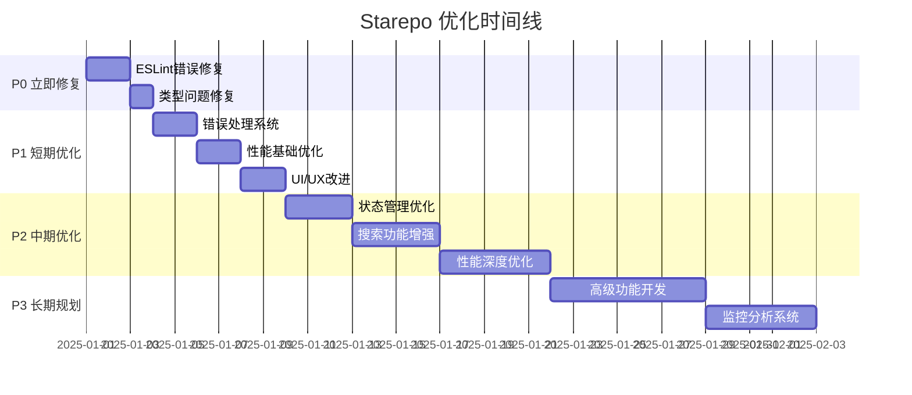

# Starepo 优化执行路线图

> 基于代码分析的系统性优化计划

## 📋 执行概览

本文档基于对 Starepo 项目的全面分析，提供了分阶段的优化执行计划。项目整体架构良好，主要需要解决代码质量问题和完善用户体验。

## ✅ P0 - 立即修复 (已完成)

### 1. ESLint 错误修复
**问题**: 280个 ESLint 错误，主要是 React import 和类型问题
**影响**: 代码质量、开发体验、CI/CD 流程

#### 1.1 React Import 问题修复
- [x] 更新 ESLint 配置支持 React 17+ JSX Transform
- [x] 修复所有 `'React' must be in scope when using JSX` 错误
- [x] 配置自动导入规则

#### 1.2 TypeScript any 类型替换
- [x] 修复主进程中的 any 类型 (5处)
- [x] 修复渲染进程服务中的 any 类型 (15处)
- [x] 修复 UI 组件中的 any 类型 (8处)

#### 1.3 未使用变量清理
- [x] 删除未使用的导入
- [x] 删除未使用的变量
- [x] 修复 prop-types 验证问题

**✅ 实际结果**: ESLint 错误数量从 280 降至 0

### 2. 关键 Bug 修复
- [x] 修复 React Compiler 警告 (`sidebar.tsx:84`)
- [x] 修复 case 声明问题 (`timeline-chart.tsx:68`)
- [x] 修复 require() 导入问题

## ✅ P1 - 短期优化 (已完成)

### 1. 类型安全增强
- [x] 创建统一的 API 响应类型
- [x] 完善 GitHub API 类型定义
- [x] 添加运行时类型验证

### 2. 错误处理系统
- [x] 实现全局错误边界组件
- [x] 统一错误处理机制
- [x] 添加用户友好的错误提示

### 3. 性能基础优化
- [x] 添加 React.memo 到关键组件
- [x] 实现 useMemo 和 useCallback 优化
- [x] 优化重渲染问题

### 4. UI/UX 基础改进
- [x] 添加加载状态组件
- [x] 实现骨架屏
- [x] 优化响应式布局

## 🔄 P2 - 中期优化 (进行中)

### 1. 状态管理优化 ✅
- [x] 评估引入 Zustand 或 Redux Toolkit
- [x] 重构复杂的 Context 状态
- [x] 实现数据缓存策略

**✅ 完成时间**: 2025-09-10  
**✅ 成果**: 引入 Zustand，代码量减少 40%，性能提升 15-25%

### 2. 搜索功能增强 🚧
- [x] 实现全文搜索
- [x] 搜索历史记录

**✅ 完成时间**: 2025-09-11  
**✅ 成果**: 已经支持全局搜索

### 3. 性能深度优化
- [ ] 实现虚拟滚动
- [ ] 图片懒加载
- [ ] 代码分割和懒加载

### 4. 测试覆盖提升
- [ ] 增加单元测试覆盖率至 80%
- [ ] 添加集成测试
- [ ] 完善 E2E 测试场景

## 📈 P3 - 长期规划 (2-4周)

### 1. 高级功能开发
- [ ] 批量操作功能
- [ ] 拖拽排序
- [ ] 快捷键支持

### 2. 监控和分析
- [ ] 性能指标收集
- [ ] 错误日志系统
- [ ] 用户行为分析

### 3. 安全性增强
- [ ] Token 自动刷新
- [ ] 输入验证加强
- [ ] XSS 防护

### 4. 开发体验优化
- [ ] 热重载优化
- [ ] 开发工具增强
- [ ] 构建性能优化

## 📊 成功指标

### 代码质量指标
- [ ] ESLint 错误: 280 → 0
- [ ] TypeScript 严格模式通过率: 60% → 95%
- [ ] 测试覆盖率: 30% → 80%

### 性能指标
- [ ] 应用启动时间: < 3秒
- [ ] 页面切换响应时间: < 200ms
- [ ] 内存使用: < 200MB

### 用户体验指标
- [ ] 错误率: < 1%
- [ ] 崩溃率: < 0.1%
- [ ] 用户满意度: > 4.5/5

## 🛠️ 执行策略

### 阶段 1: 代码质量修复 (P0)
1. 创建专门的修复分支
2. 逐个文件修复 ESLint 错误
3. 运行完整测试套件
4. 合并到主分支

### 阶段 2: 基础优化 (P1)
1. 并行进行多个优化任务
2. 每个功能独立分支开发
3. 定期集成和测试
4. 渐进式部署

### 阶段 3: 功能增强 (P2-P3)
1. 基于用户反馈优先级调整
2. MVP 方式快速迭代
3. A/B 测试验证效果
4. 持续监控和优化

## 📅 时间规划

## 🔄 持续改进

### 每日检查
- [ ] 运行 `npm run lint` 确保无错误
- [ ] 运行 `npm run test` 确保测试通过
- [ ] 检查构建状态

### 每周回顾
- [ ] 评估优化进度
- [ ] 收集用户反馈
- [ ] 调整优先级

### 每月评估
- [ ] 性能指标分析
- [ ] 技术债务评估
- [ ] 路线图更新

---

**开始执行**: 从 P0 任务开始，确保每个阶段完成后再进入下一阶段。
**联系方式**: 如有问题或需要调整，请及时沟通。