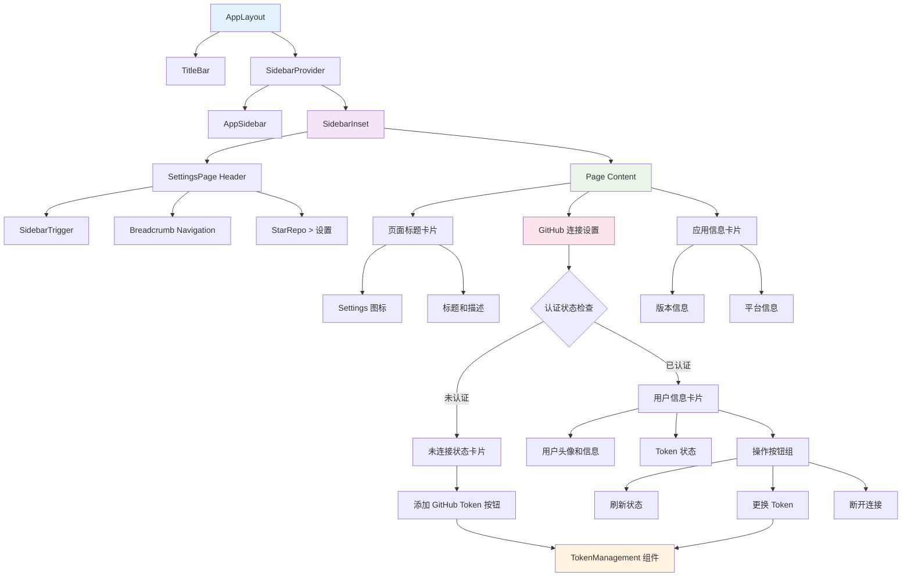
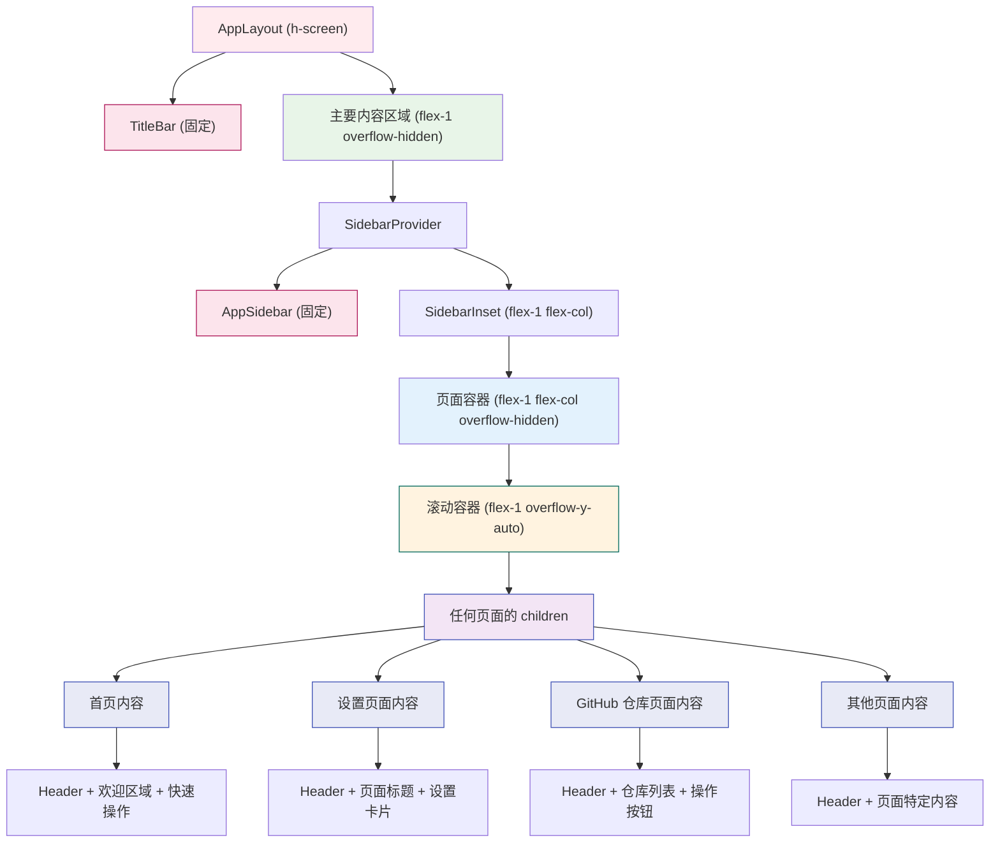

# 设置页面使用指南

## 概述

已成功为 StarRepo 创建了一个全面的设置界面，主要用于 GitHub Token 的维护和管理。

## 功能特性

### 1. 外观设置
- **主题管理**：支持浅色、深色、跟随系统三种主题模式
- **实时切换**：主题变更立即生效，无需重启应用
- **系统集成**：跟随系统主题模式自动适配
- **语言设置**：支持中文简体和英文界面切换
- **持久化存储**：设置自动保存，重启后保持

### 2. GitHub 连接管理
- **Token 状态显示**：实时显示当前 GitHub 连接状态
- **用户信息展示**：显示已连接的 GitHub 用户详细信息
- **Token 验证**：实时验证 Token 有效性和权限范围
- **快速跳转**：点击用户头像、用户名或统计数字快速跳转到 GitHub 对应页面

### 3. Token 管理功能
- **添加 Token**：为未连接状态下的用户提供 Token 输入界面
- **更换 Token**：允许已连接用户更换新的 Token
- **Token 验证**：
  - 格式验证（支持 Classic 和 Fine-grained tokens）
  - 权限范围检查
  - 用户信息获取

### 4. 应用设置
- **自动同步**：配置 GitHub Star 项目自动同步
- **缓存管理**：清理本地缓存数据
- **开发者模式**：启用调试工具和开发功能
- **日志级别**：调整应用日志详细程度

### 5. 安全特性
- **安全存储**：使用 Electron safeStorage 加密存储 Token
- **权限验证**：检查 Token 是否具有必要的权限范围
- **状态管理**：实时同步认证状态变化

## 页面结构

### 路由配置
- **路径**：`/settings`
- **组件**：`SettingsPage`
- **导航**：在侧边栏"设置"选项中可访问

### 主要组件

#### 1. SettingsPage (`src/renderer/pages/settings-page.tsx`)
- 主设置页面容器
- 管理 GitHub 连接状态显示
- 处理 Token 管理流程

#### 2. TokenManagement (`src/renderer/components/github/token-management.tsx`)
- 专门的 Token 管理界面
- 实时 Token 验证
- 权限范围检查和显示

#### 3. 新增 UI 组件
- **Card** (`src/renderer/components/ui/card.tsx`)：卡片容器
- **Badge** (`src/renderer/components/ui/badge.tsx`)：状态标签

### 组件结构

设置页面现在完全集成到应用的整体布局中：



#### 布局特点

1. **复用应用布局**：设置页面现在使用 `AppLayout` 组件，确保与其他页面的一致性
2. **标准化头部**：包含侧边栏触发器、面包屑导航等标准元素
3. **一致的间距和样式**：与首页等其他页面保持相同的视觉风格
4. **响应式设计**：继承应用布局的响应式特性
5. **滚动支持**：正确处理内容溢出，支持垂直滚动

#### 系统性滚动修复

**问题根源**：`AppLayout` 组件的 `overflow-hidden` 设置影响了所有页面的滚动功能。

**解决方案**：在 `AppLayout` 组件中添加了滚动容器，现在所有页面都自动支持滚动。



**修复的关键要点：**
- 🎯 **统一解决**：一次修复解决了所有页面的滚动问题
- 📌 **固定元素**：标题栏、侧边栏保持固定位置
- 📜 **自动滚动**：所有页面内容现在都自动支持垂直滚动
- 🔧 **简化开发**：页面开发者不再需要手动处理滚动容器

## 使用流程

### 首次设置 GitHub Token

1. 打开应用程序
2. 点击侧边栏的"设置"选项
3. 在"GitHub 连接"卡片中点击"添加 GitHub Token"
4. 按照页面指引获取 Personal Access Token：
   - 访问 GitHub Settings → Developer settings → Personal access tokens
   - 点击 "Generate new token (classic)"
   - 设置必要权限：`user`, `public_repo`, `repo`（可选）
5. 将 Token 粘贴到输入框
6. 系统自动验证 Token 有效性
7. 验证通过后点击"添加 Token"完成设置

### 更换 GitHub Token

1. 在设置页面中，已连接状态下点击"更换 Token"
2. 输入新的 Personal Access Token
3. 系统验证新 Token 的有效性
4. 确认更换后，原 Token 将被新 Token 替换

### 管理连接状态

- **刷新状态**：重新验证当前 Token 有效性
- **断开连接**：清除所有认证信息，返回未连接状态

## 技术实现

### 认证流程
```typescript
// 使用 GitHubAuthService 进行认证
const result = await githubAuthService.authenticateWithToken(token);
if (result.success) {
  // 认证成功，更新状态
  setAuthState(result.authState);
}
```

### 状态监听
```typescript
// 监听认证状态变化
useEffect(() => {
  const unsubscribe = githubAuthService.addAuthListener((state) => {
    setAuthState(state);
  });
  return unsubscribe;
}, []);
```

### Token 验证
```typescript
// 实时 Token 验证
const validation = await githubAuthService.validateToken(token);
if (validation.valid) {
  // Token 有效，显示用户信息和权限
}
```

## 安全考虑

1. **加密存储**：所有 Token 使用 Electron safeStorage 加密存储
2. **权限最小化**：只请求必要的 GitHub 权限
3. **状态隔离**：主进程和渲染进程完全分离
4. **输入验证**：多层次的 Token 格式和有效性验证

## 后续扩展

设置页面架构支持轻松添加新的配置选项：

1. **应用设置**：主题、语言、缓存等
2. **同步设置**：自动同步频率、同步范围等
3. **AI 设置**：AI 模型选择、API 配置等
4. **数据管理**：数据导出、清理、备份等

## 故障排除

### 常见问题

1. **Token 验证失败**
   - 检查 Token 格式是否正确
   - 确认 Token 权限范围是否足够
   - 检查网络连接

2. **认证状态异常**
   - 点击"刷新状态"重新验证
   - 清除认证信息后重新设置

3. **页面无法访问**
   - 确认路由配置正确
   - 检查组件是否正确导入

4. **外部链接跳转失败**
   - 检查控制台是否有错误信息
   - 确认已重启应用以加载 shell 处理器
   - 如果 Electron API 失败，会自动使用浏览器打开链接

### 调试信息

外部链接功能使用以下流程：
1. 渲染进程调用 `window.electronAPI.shell.openExternal(url)`
2. 通过 IPC 发送请求到主进程的 shell 处理器
3. 主进程验证 URL 安全性（只允许 HTTP/HTTPS/mailto）
4. 使用 `shell.openExternal()` 在默认浏览器中打开
5. 如果失败，渲染进程会使用 `window.open()` 作为备用方案

## 🎯 新增功能亮点

### 外观设置统一管理
- **集中控制**：主题和语言设置现在统一在设置页面中管理
- **即时生效**：切换主题或语言立即生效，无需重启应用
- **视觉反馈**：当前选择的选项有明显的视觉指示
- **易于访问**：从首页移除了分散的控制按钮，统一到设置页面

### GitHub 信息快速跳转
- **一键访问**：点击用户头像、用户名直接跳转到 GitHub 个人主页
- **分类统计**：点击仓库、关注者、关注数跳转到对应的 GitHub 页面
- **视觉提示**：悬停时显示外部链接图标，提供清晰的交互反馈
- **无缝跳转**：在默认浏览器中打开对应页面，保持原生体验

### 用户体验改进
- **更整洁的首页**：移除了主题和语言切换按钮，界面更简洁
- **逻辑分组**：相关设置功能合理分组，便于查找和使用
- **一致的设计**：所有设置项采用统一的设计语言和交互模式
- **智能交互**：丰富的交互反馈，包括悬停效果、过渡动画等

通过这个完善的设置界面，用户可以便捷地管理应用的所有配置，包括外观、GitHub 连接、应用行为等，为后续的功能使用提供了完整的配置基础。
